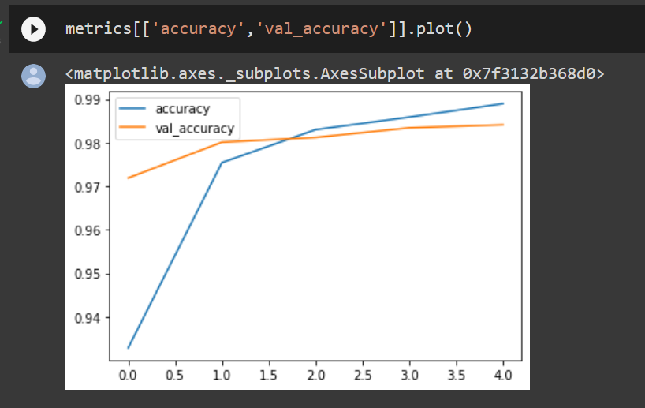
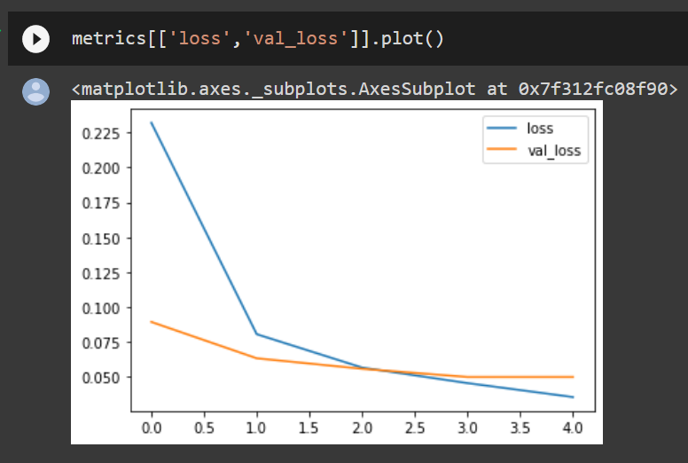
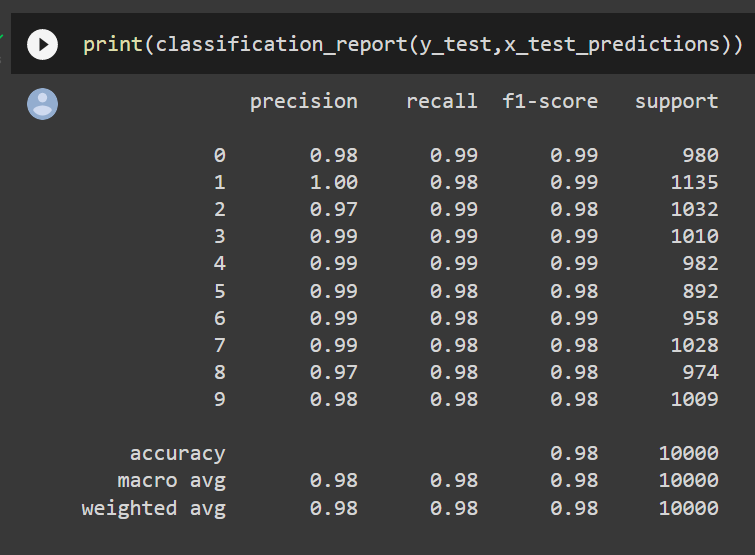
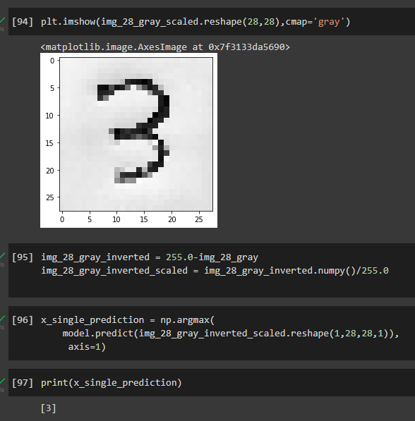

# Convolutional Deep Neural Network for Digit Classification

## AIM

To Develop a convolutional deep neural network for digit classification and to verify the response for scanned handwritten images.

## Problem Statement and Dataset

## Neural Network Model

Include the neural network model diagram.

## DESIGN STEPS

### STEP 1:
Import the necessary packages and load the mnist dataset.

### STEP 2:
Consider 60,000 examples in the training dataset and 10,000 in the test dataset and that images are indeed square with 28×28 pixels.

### STEP 3:
Plot the first images in the dataset

### STEP 4:
use a one hot encoding for the class element of each sample, transforming the integer into a 10 element binary vector with a 1 for the index of the class value, and 0 values for all other classes.

### STEP 5:
Normalize the pixel values to 0/1.

### STEP 6:
Create a baseline convolutional neural network model for the problem and compile it.

### STEP 7:
plot the graph-Training Loss, Validation Loss Vs Iteration Plot

### STEP 8:
Evaluate the model through classification report and confusion matrix.

### STEP 9:
Predict the output for the given handwritten input.

## PROGRAM
```
import numpy as np
from tensorflow import keras
from tensorflow.keras import layers
from tensorflow.keras.datasets import mnist
import tensorflow as tf
import matplotlib.pyplot as plt
from tensorflow.keras import utils
import pandas as pd
from sklearn.metrics import classification_report,confusion_matrix
from tensorflow.keras.preprocessing import image
(X_train, y_train), (X_test, y_test) = mnist.load_data()
X_train.shape
X_test.shape
single_image= X_train[0]
single_image.shape
plt.imshow(single_image,cmap='gray')
y_train.shape
X_train.min()
X_train.max()
X_train_scaled = X_train/255.0
X_test_scaled = X_test/255.0
X_train_scaled.min()
X_train_scaled.max()
y_train[0]
y_train_onehot = utils.to_categorical(y_train,10)
y_test_onehot = utils.to_categorical(y_test,10)
type(y_train_onehot)
y_train_onehot.shape
single_image = X_train[5000]
plt.imshow(single_image,cmap='gray')
y_train_onehot[5000]
X_train_scaled = X_train_scaled.reshape(-1,28,28,1)
X_test_scaled = X_test_scaled.reshape(-1,28,28,1)
model = keras.Sequential()
# Write your code here
model.summary()
# Choose the appropriate parameters
model.compile(loss='categorical_crossentropy',
              optimizer='adam',
              metrics='accuracy')
model.fit(X_train_scaled ,y_train_onehot, epochs=5,
          batch_size=64, 
          validation_data=(X_test_scaled,y_test_onehot))
metrics = pd.DataFrame(model.history.history)
metrics.head()
metrics[['accuracy','val_accuracy']].plot()
metrics[['loss','val_loss']].plot()
x_test_predictions = np.argmax(model.predict(X_test_scaled), axis=1)
print(confusion_matrix(y_test,x_test_predictions))
print(classification_report(y_test,x_test_predictions))
Prediction for a single input

from tensorflow.keras.preprocessing import image
img = image.load_img('pic-07.png')
img_tensor = tf.convert_to_tensor(np.asarray(img))
img_28 = tf.image.resize(img_tensor,(28,28))
img_28_gray = tf.image.rgb_to_grayscale(img_28)
img_28_gray_scaled = img_28_gray.numpy()/255.0
x_single_prediction = np.argmax(
    model.predict(img_28_gray_scaled.reshape(1,28,28,1)),
     axis=1)
print(x_single_prediction)
plt.imshow(img_28_gray_scaled.reshape(28,28),cmap='gray')
img_28_gray_inverted = 255.0-img_28_gray
img_28_gray_inverted_scaled = img_28_gray_inverted.numpy()/255.0
x_single_prediction = np.argmax(
    model.predict(img_28_gray_inverted_scaled.reshape(1,28,28,1)),
     axis=1)
print(x_single_prediction)
```


## OUTPUT

### Training Loss, Validation Loss Vs Iteration Plot



### Classification Report



### Confusion Matrix



### New Sample Data Prediction



## RESULT
A convolutional deep neural network for digit classification and to verify the response for scanned handwritten images is developed sucessfully.